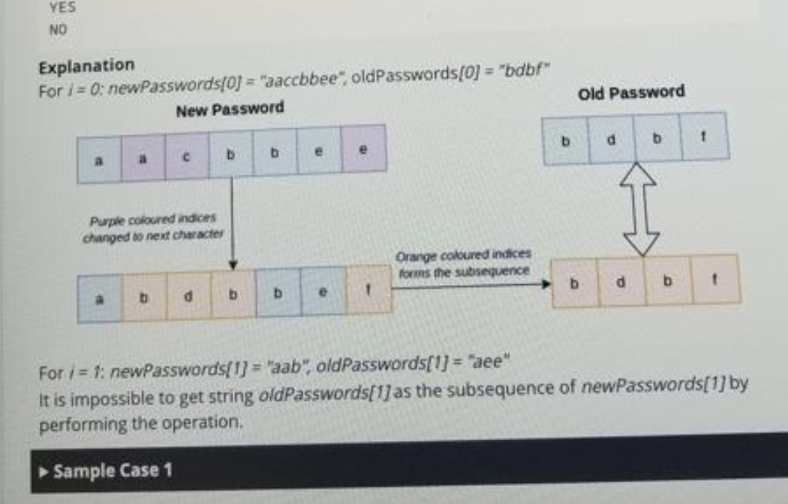

Check Similar Passwords 🍋  
🤘 INTERN
👩‍🎓 NEW GRAD
📚
RELATED PROBLEMS  
Amazon would like to enforce a password policy that when a user changes their password, the new password cannot be similar to the current one. To determine whether two passwords are similar, they take the new password, choose a set of indices and change the characters at these indices to the next cyclic character exactly once. Character 'a' is changed to "b", 'b' to 'c' and so on, and 'z' changes to 'a'. The password is said to be similar if after applying the operation, the old password is a subsequence of the new password.  

The developers come up with a set of n password change requests, where newPasswords denotes the array of new passwords and oldPasswords denotes the array of old passwords. For each pair newPasswords[i] and oldPassword[i], return "YES" if the passwords are similar, that is newPasswords[i] becomes a subsequence of oldPasswords[i] after performing the operations, and "NO" otherwise.  

Note
  
A subsequence is a sequence that can be derived from the given sequence by deleting zero or more elements without changing the order of the remaining elements.

Function Description  

Complete the function checkSimilarPasswords in the editor.
  
checkSimilarPasswords has the following parameters:

string newPasswords[n]: newPasswords[i] represents the new password of the ith pair
string oldPasswords[n]: newPasswords[i] represents the old password of the ith pair  
Returns

string[n]: the ith string represents the answer to the ith pair of passwords.  
  
Example 1:

Input:  newPasswords = ["baacbab", "accdb", "baacba"], oldPasswords = ["abdbc", "ach", "abb"]
Output: ["YES", "NO", "YES"] 
Explanation:
   

Consider the first pair: newPasswords[0] = "baacbab" and oldPasswords = "abdbc". Change "ac" to "bd" at the 3rd and 4th positions, and "b" to "c" at the last position.
The answer for this pair is YES.   

The newPasswords[1] = "accdb" and oldPasswords = "ach".
It is not possible to change the character of the new password to "h" which occurs in the old password, so there is no subsequence that matches. 
The answer for this pair is NO.   

newPasswords[2] = "baacba" and oldPasswords  = "abb".
The answer for this pair is YES.

Eventually, we return ["YES", "NO", "YES"].
    
      
Example 2:  

Input:  newPasswords = ["aaccbbee", "aab"], oldPasswords = ["bdbf", "aee"]
Output: ["YES", "NO"] 
Explanation:
  

For i = 0; newPasswords[0] = "aaccbbee", oldPasswords[0] = "bdbf"
  
For i = 1, newPassword[1] = "aab", oldPasswords[1] = "aee".
It is impossible to get string oldPasswords[1] as the subsequence of newPasswords[1] by performing the operation.

Eventually, we return ["YES", "NO"].  

      
Constraints:
1 <= n <= 10
Sum of lengths of all passwords in array newPassword and array oldPasswords does not exceed (2 * 105)
|oldPasswords[i] <= |newPasswords[i]| for all i  

  
class Solution:
  def checkSimilarPasswords(self, newPasswords: List[str], oldPasswords: List[str]) -> List[str]:

