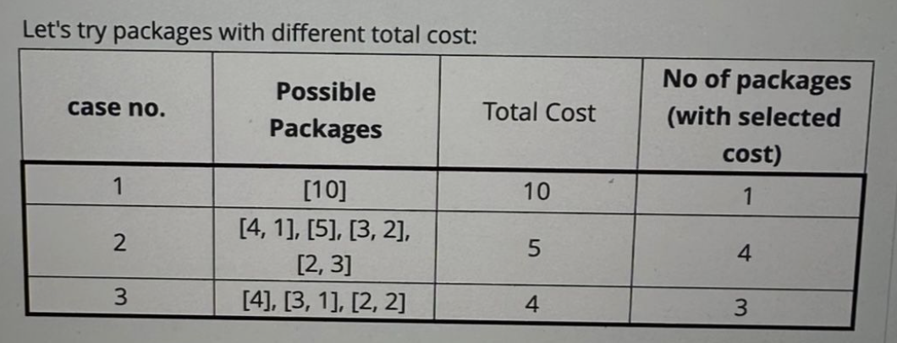
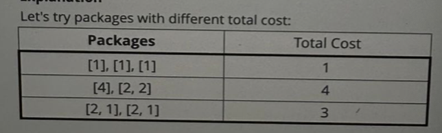
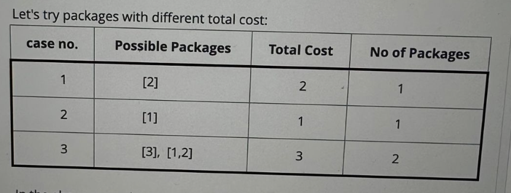
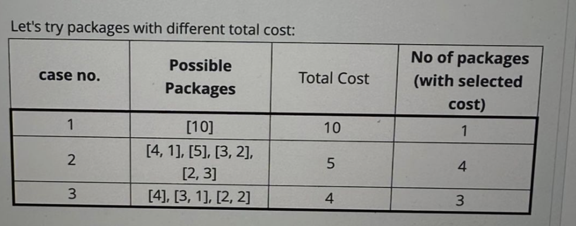

Find Maximum Packages  
👩‍🎓 NEW GRAD  
📚 AMAZON  

In Amazon's online marketplace, the inventory manager is exploring strategies to enhance product sales. The focus is on creating appealing packages that offer customers a delightful shopping experience. To achieve this, the inventory manager aims to construct packages, each containing at most 2 items, to have an equal total cost across all packages. The total cost of a package is defined as the sum of the costs of the items contained within.

Formally, given an array cost of size n, representing the costs of individual items, determine the maximum number of packages that can be created, such that each package adheres to the constraint of having at most 2 items, and all packages have the same cost.

Note that each item can be used in at most one package.

Function Description

Complete the function findMaximumPackages in the editor.

findMaximumPackages has the following parameter:

int cost[n]: an array of integers denoting the cost of each item in the shop.
Returns

int: the maximum number of packages that can be made having the same cost, where each package consists of at most 2 items.

Example 1:

Input:  cost = [4, 5, 10, 3, 1, 2, 2, 2, 3]
Output: 4 
Explanation:  
  

In the above example, the store manager can create 3 different types of packages with costs of 10, 5, and 4. However, the maximum number of packages that can be created with each package having an equal cost is 4, each with a cost of 5. Therefore, the answer is 4.

Example 2:  

Input:  cost = [1, 1, 2, 2, 1, 4]   
Output: 3   
Explanation:  

 
Let's try packages with different total cost:  
For the three package offers with total costs of 1, 4, and 3, the number of packages made are 3, 2, and 2 respectively. So the inventory manager will make pacakages with a total cost of 1 since they can make the maximum packages of it. Hence, the answer is 3.

Example 3:

Input:  cost = [2, 1, 3]
Output: 2 
Explanation:

 
Let's try packages with different total cost:
   
In the above example, it is only possible to create 1 package with cost 2, similarly only one package can be created with cost 1, but with the cost 3 we can create 3 packages, which is the max possible packages with each pacakage having same total cost, hence the answer is 2

Example 4:

Input:  cost = [4, 5, 10, 3, 1, 2, 2, 2, 3]
Output: 4 
Explanation:

 
Let's try packages with different total cost:
  
In the above example, the store manager can create 3 different types of packages with costs of 10, 5, 4. However, the max num of packages that can be created with each package having an equal cost is 4, each with a cost of 5. So the answer is 4.

Example 5:

Input:  cost = [10, 2, 1]
Output: 1 
Explanation:

 
All the package offers with the same total cost will have only 1 package, hence the answer is 1.   

Constraints:  
1 ≤ n ≤ 2 * 10^5   
1 ≤ cost[i] ≤ 2000   

Solution:   
<pre> 
class Solution:
  def findMaximumPackages(self, cost: List[int]) -> int:
      cost_counter = [0] * 2001
      for x in cost:
          cost_counter[x] += 1
      max_num = 0
      package_numbers = [0] * 4001
      for i in range(1,20001):
          package_numbers[i] += cost_counter[i]
      for i in range(1, 2001):
          package_numbers[i+i] += cost_counter[i] // 2
      for i in range(1, 2001):
          for j in range(i+1, 2001):
              package_numbers[i+j] +=min(cost_counter[i], cost_counter[j])
      for i in range(1,4001):
          max_num = max(max_num,package_numbers[i])
      return max_num
</pre>

      

